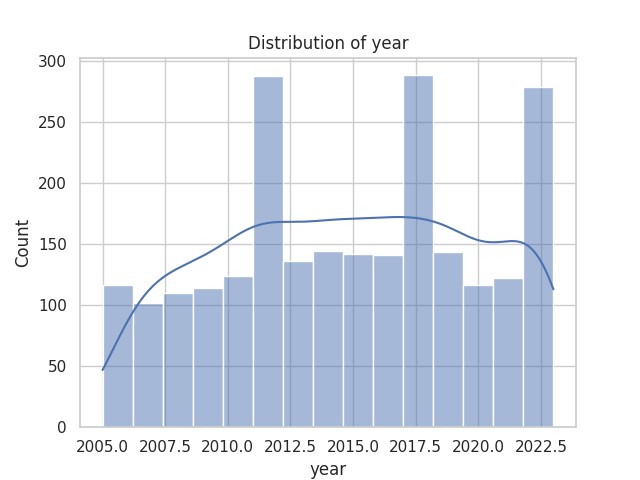
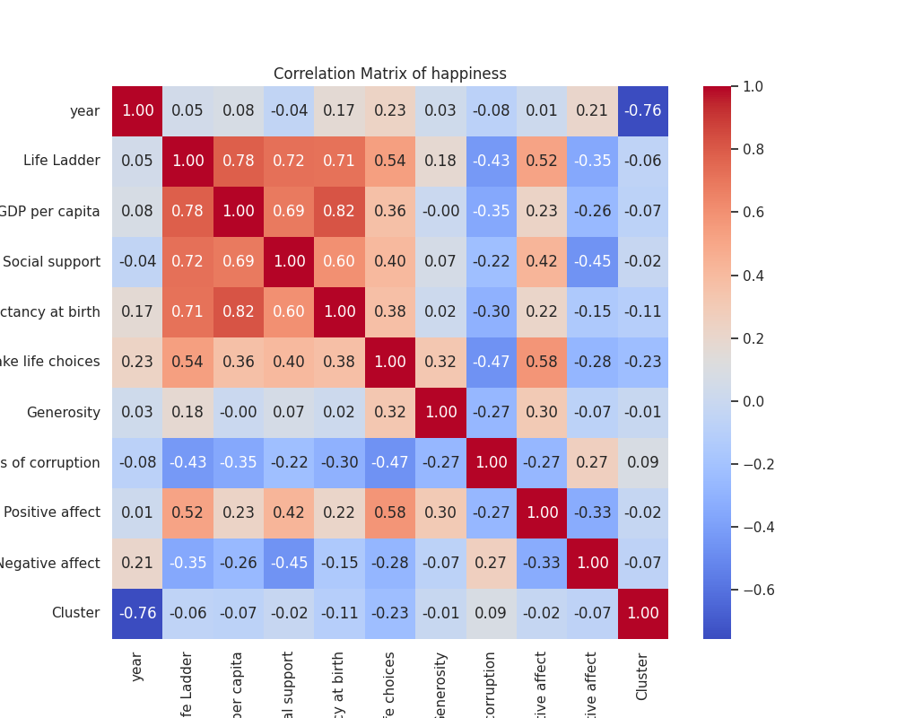
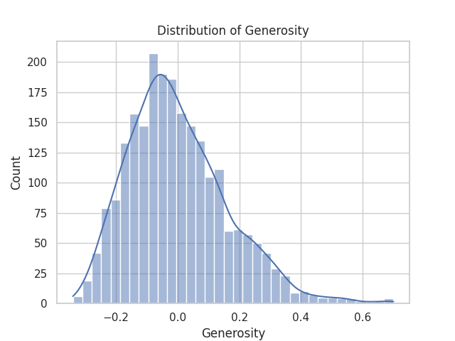

The provided data summary offers a comprehensive overview of various aspects related to happiness across different countries and years. The summary includes statistical data on several factors that are believed to influence happiness, such as GDP per capita, social support, healthy life expectancy, freedom to make life choices, generosity, perceptions of corruption, and measures of positive and negative affect. Let's analyze these aspects step by step.

### Summary Statistics Overview

1. **Country Distribution**:
   - A total of 2,363 records were collected across 165 unique countries.
   - Argentina was the most frequently occurring country in the dataset, appearing 18 times.

2. **Year Range**:
   - The dataset encompasses years from 2005 to 2023, with a mean year of approximately 2015.
   - The standard deviation of around 5.05 indicates a balanced distribution of years, with quartiles showing a progression over time.

### Key Variables

3. **Life Ladder (Happiness Score)**:
   - The mean Life Ladder score, which is a primary indicator of happiness, is approximately 5.48 on a scale that typically ranges from 0 to 10.
   - The distribution is fairly normal around the mean, with a maximum of about 8.02 and a minimum of approximately 1.28, indicating significant variation in happiness levels across different observations.

4. **Log GDP per Capita**:
   - The average Log GDP per capita is about 9.40, with the interquartile range suggesting considerable economic diversity.
   - A maximum value of around 11.68 suggests some countries have significantly higher economic output per capita.

5. **Social Support**:
   - With an average of 0.81, social support is positively correlated with happiness.
   - A relatively narrow range between the minimum (0.23) and the maximum (0.99) indicates high levels of social support in many countries, which is an essential factor for happiness.

6. **Healthy Life Expectancy**:
   - Average healthy life expectancy stands at around 63.40 years, pointing to significant disparities, especially where the minimum value is just 6.72 years.
   - This factor is correlated with life satisfaction, indicating that healthier populations tend to report higher happiness levels.

7. **Freedom to Make Life Choices**:
   - A mean score of around 0.75 shows that individuals in the countries surveyed generally experience a moderate degree of freedom, which is crucial for personal happiness.

8. **Generosity**:
   - The mean score is very low (approximately 0.0001), indicating that overall, the measured generosity is quite minimal. This is notable especially since generosity correlates with positive societal well-being.

9. **Perceptions of Corruption**:
   - This variable has a mean score of approximately 0.74, which suggests that corruption is perceived to be an issue in many countries. However, there is some variation, with the maximum value being around 0.98.

10. **Affect Measures**:
    - **Positive Affect**: An average of 0.65 with a range showcasing some variation in emotional positivity across populations.
    - **Negative Affect**: The mean score of 0.27 is relatively low, indicating that negative feelings are less dominant, which is a positive sign for overall societal happiness.

### Correlation Analysis

11. The correlation matrix illustrates the relationships between different factors affecting happiness:
   - **Life Ladder has a strong correlation with Log GDP per capita (0.78)**, indicating wealthier nations tend to report higher levels of happiness.
   - Similar positive correlations exist with Social Support (0.72) and Healthy Life Expectancy (0.71), suggesting these dimensions also significantly contribute to the perception of happiness.
   - Interestingly, Freedom to Make Life Choices exibits a moderate correlation (0.54), reinforcing the importance of autonomy for well-being.
   - There is a notable negative correlation between Life Ladder and Perceptions of Corruption (-0.43), suggesting that less perceived corruption aligns with higher happiness scores.

### Clustering

12. The clustering results, which categorize the data into three main groups with varying sizes (908, 602, and 853), can suggest the presence of different happiness profiles within these groups. Investigating the characteristics of each cluster could provide insights into common factors influencing happiness within those groups.

### Conclusions

This analysis indicates that happiness is a complex construct influenced by multiple societal factors. The most significant predictors of happiness, based on the data, appear to be economic wealth (Log GDP per capita), social support, healthy life expectancy, and perceptions of freedom and corruption. While Argentina is the most frequently studied country, the diversity of the dataset presents an opportunity for further analysis to uncover specific regional or cultural influences on happiness. The presence of missing values in various variables also highlights areas where further data collection could enhance understanding. Overall, this summary provides a solid foundational basis for deeper investigations into the determinants of happiness across different demographics and geographies.

## Visualizations

